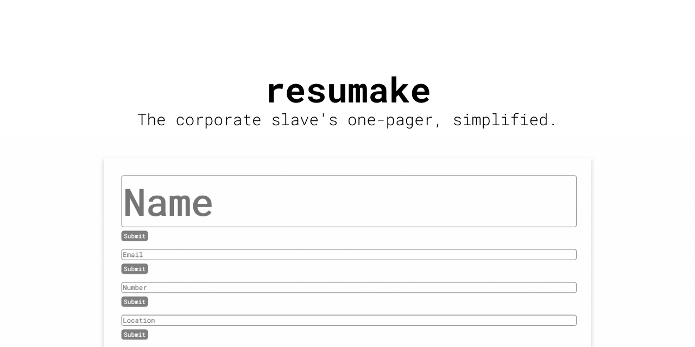
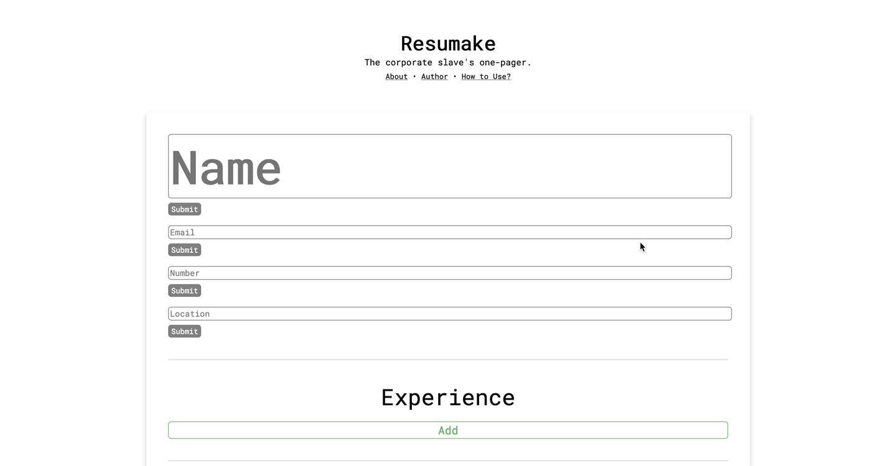

`resumake` is a web application that allows users the utilization of a straightforward resume-building interface. It was built in [partial completion](https://www.theodinproject.com/paths/full-stack-javascript/courses/javascript/lessons/cv-application) of The Odin Project's Full-stack JavaScript Path.

## Installation

1. Clone the repository with `git clone https://github.com/FrancisLangit/resumake` or download it as a `.zip` file.
2. Navigate to where the repository is saved on your local machine on a command line.
3. Enter `npm install` to install the application's dependencies.

## Setup

There are two ways to run the web application locally. One may run either of the following upon navigating to the repository on a command line.

### `npm start`

Such will run the app in development mode, allowing one to open up http://localhost:3000 to use the application.

### `npm run build`

Run such to create a locally constructed instance of the web application. If successful, one should fine a `build/` folder generated within the repository.

## Usage

To generate your very own customized resume, enter data into the application's form. Should you wish to make a change to any of the page's fields, simply click on the component of choice and the section should open back up for editing.

## Contributing

Contact the author of this repository should you have interests in making a contribution.

## License

[MIT License](https://github.com/FrancisLangit/resumake/blob/main/LICENSE)
